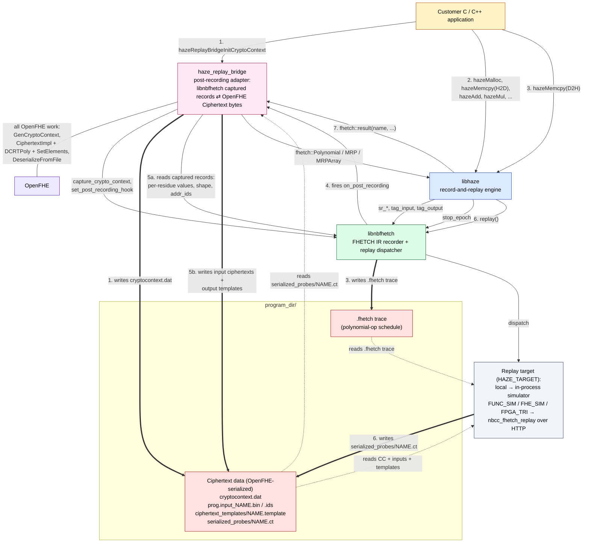

# haze_replay_bridge — OpenFHE boundary for haze

A small shared library that adapts between libnbfhetch's captured-record
format and OpenFHE-serialized `Ciphertext<DCRTPoly>` files on disk.
`libhaze` is FHETCH-only; the bridge is the **single** TU in the project
that links OpenFHE, so OpenFHE never leaks into libhaze's public surface
or any downstream consumer.

The bridge holds **no file-scope state**. Everything the post-recording
hook needs is captured into the lambda installed on
`niobium::compiler().set_post_recording_hook(...)`; that lambda is freed
when the next install replaces it or when `niobium::compiler().reset()`
drops it (via `hazeDeviceReset`). CT shells are built directly through
`make_shared<CiphertextImpl<DCRTPoly>>(cc, ...) + SetElements`, so the
bridge never calls `KeyGen` or `Encrypt` — no keys live anywhere, and
the `Register*` API takes only a CryptoContext, not a KeyPair.

## Architecture

Solid `-->` is a function call. Thick `==>` is a filesystem write
(label = file written). Dashed `-.->` is a filesystem read.
`program_dir/` holds two kinds of artifact: ciphertext data (every
OpenFHE-serialized file — bridge-owned) and the `.fhetch` trace
(libnbfhetch-owned).



**Step 5 is the bridge's reason to exist.** `on_post_recording` fires
after libnbfhetch finishes the `.fhetch` trace but before replay starts.
It walks libnbfhetch's captured-input / captured-output records, builds
a matching `Ciphertext<DCRTPoly>` via OpenFHE (filled for inputs, empty
for outputs), and serializes it. The replay target's IO boundary is
therefore pure OpenFHE-serialized ciphertexts. Step 7 is the reverse
half: the `fhetch::result(...)` overloads — defined in the bridge dylib
with default visibility so libhaze's link line resolves them — read a
probe `.ct` back as an `fhetch::` type.

## Public surface

The bridge is a pure-C ABI (in
[`include/haze/replay_bridge.h`](include/haze/replay_bridge.h)):

```c
hazeError_t hazeReplayBridgeInitCryptoContext(uint64_t ring_dim,
                                              uint64_t desired_modulus,
                                              uint64_t *picked_modulus);
void        hazeReplayBridgeReset(void);
int         hazeReplayBridgeTakeHookHadError(void);
```

There is no live-`lbcrypto`-object entry point: callers convey everything haze
needs as scalars + uint64 limbs. `Init` builds the CryptoContext from
`(ring_dim, desired_modulus)` and the per-shape moduli recovered from the trace;
keyswitch keys are extracted to raw limbs caller-side (see
[`test/openfhe_key_extract.hpp`](../test/openfhe_key_extract.hpp)) and replayed
through haze's MRP C ABI, so the bridge never touches a caller's OpenFHE objects.

Init must be called after every `hazeDeviceReset` (which fires
`hazeReplayBridgeReset` for you);
[`test/integration_helpers.hpp`](../test/integration_helpers.hpp)'s
`setup_integration_compute_config` is the canonical caller. A new Init replaces
a prior one; the lambda holding its state lives until the next install or the
next device reset.

## Source layout

| Path                                       | What                                                  |
| ------------------------------------------ | ----------------------------------------------------- |
| `include/haze/replay_bridge.h`             | The public C ABI (Init / Reset / TakeHookHadError).  |
| `src/openfhe_template.cpp`                 | Everything else: `build_context`, shape dispatch (SRP/MRP/SRPArray/MRPArray) via `SetElements`, the `on_post_recording` hook lambda, `fhetch::result` overloads. |
| `CMakeLists.txt`                           | Builds `haze_replay_bridge` SHARED, linked PRIVATE into `libhaze`. |
