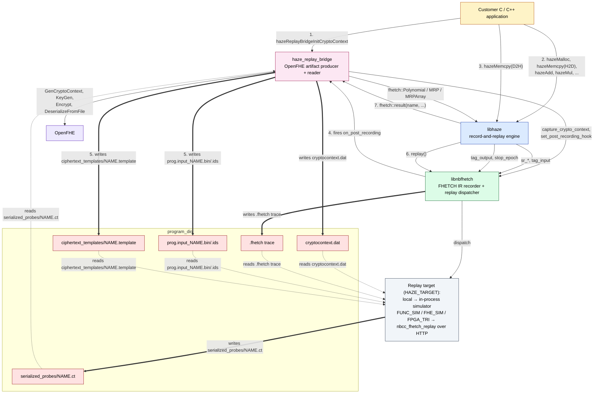
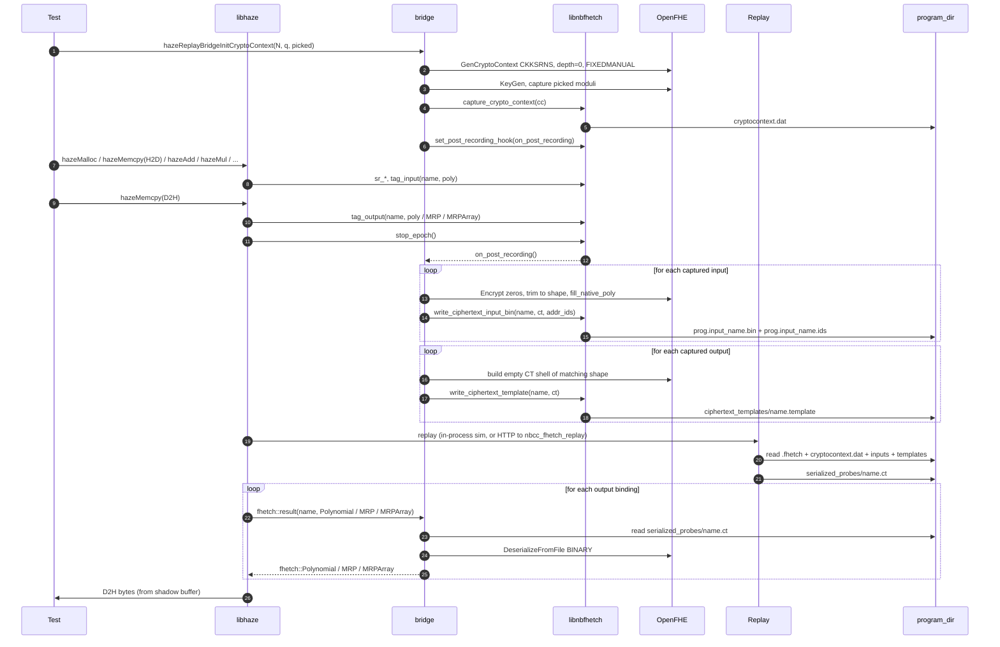
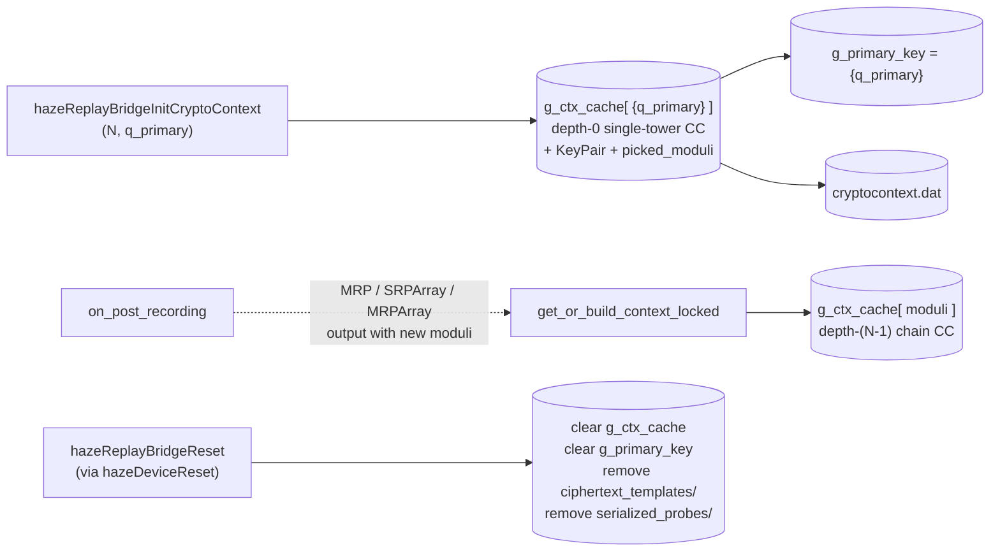

# haze_replay_bridge — OpenFHE boundary for haze

A small shared library that synthesizes the OpenFHE artifacts the replay path
needs in order to consume a haze recording. `libhaze` itself is FHETCH-only
and links no OpenFHE; the bridge is the **single** translation unit in the
project that does. Splitting it out keeps `<openfhe.h>` out of `libhaze`'s
public surface and out of every downstream consumer that does not explicitly
opt in.

The bridge solves two problems:

1. **Inputs / templates the simulator and `nbcc_fhetch_replay` cannot build
   themselves.** A `.fhetch` trace describes polynomial-level ops; it does
   not describe the CKKS `CryptoContext`, the `Ciphertext<DCRTPoly>` shells
   that wrap each input residue, or the per-output templates the replay path
   stamps with computed values. The bridge writes all three so the replay
   path has something to deserialize from disk.

2. **`niobium::fhetch::result(...)` resolution.** `epoch.cpp` calls
   `fhetch::result(name, Polynomial& / MRP& / MRPArray&)` to read each
   tagged output back from `serialized_probes/<name>.ct`. The overloads
   are intentionally _not_ in `libnbfhetch` — that would force OpenFHE
   into every consumer of fhetch. The bridge supplies them, with default
   visibility, and `libhaze` links the bridge to satisfy the references.

## How it sits in the haze stack

The diagram below reads top to bottom in usage order. Three arrow
conventions:

- **Solid (`-->`)** is a direct symbol call between libraries. Labels name
  the function. Callbacks (libnbfhetch firing back into the bridge) are
  solid too, labeled "fires X".
- **Thick (`==>`)** is a filesystem write. Labels name the file being
  written, so producer ownership is unambiguous.
- **Dashed (`-.->`)** is a filesystem read. Labels name the file being
  read.

`program_dir/` is broken into one node per artifact so each `==>` and
`-.->` can point at exactly the file it touches.



A small implementation note: the byte-level filesystem writes for the
three bridge-owned files actually happen inside libnbfhetch's translation
unit (the `niobium::detail::write_*` helpers in [Private libnbfhetch
hooks](#private-libnbfhetch-hooks) below). That is a cereal-registration
trick — the polymorphic-type registry has to resolve in the same dylib —
but the **content**, **timing**, and **decision to write at all** are
the bridge's, so the diagram attributes those three files to the bridge.

### How the bridge gets invoked

The bridge has three entry routes, one per arrow type into the `bridge`
node above:

1. **Explicit C ABI call (step 1).** The application — usually through
   `setup_integration_compute_config` in
   [`test/integration_helpers.hpp`](../test/integration_helpers.hpp) —
   calls `hazeReplayBridgeInitCryptoContext(ring_dim, desired_modulus,
   &picked)`. The bridge builds the primary CKKS CryptoContext via
   OpenFHE, hands it to libnbfhetch (which serializes it as
   `cryptocontext.dat`), and registers `on_post_recording` as
   libnbfhetch's `post_recording_hook`. A symmetric `hazeReplayBridgeReset`
   is called from `lifecycle.cpp` on every `hazeDeviceReset`.

2. **Callback from libnbfhetch (step 4 → step 5).** During `stop_epoch`,
   libnbfhetch fires the registered post-recording hook. That is the
   bridge's `on_post_recording`. The hook walks libnbfhetch's
   captured-input and captured-output records via
   `for_each_captured_input` / `for_each_captured_output`, synthesizes
   OpenFHE `Ciphertext<DCRTPoly>` shells of the matching shape
   (`SRP` / `MRP` / `SRPArray` / `MRPArray`), and writes the rest of
   the inputs the replay target consumes.

3. **Implicit symbol resolution (step 7).** The three
   `niobium::fhetch::result` overloads libhaze calls after replay are
   _defined_ in the bridge dylib — not in libnbfhetch. They have
   default visibility (the rest of the bridge is
   `CXX_VISIBILITY_PRESET=hidden`), so libhaze's link line resolves
   `fhetch::result(name, Polynomial&)`, `... MRP&)`, and `... MRPArray&)`
   out of `libhaze_replay_bridge.dylib`. The overloads deserialize
   `serialized_probes/NAME.ct` via OpenFHE and return an `fhetch::` type
   that libhaze converts to bytes for its shadow buffer.

## Lifecycle of one epoch



Participants: `T` = test or customer app, `H` = `libhaze` (`epoch.cpp`),
`B` = `haze_replay_bridge`, `F` = `libnbfhetch`, `O` = OpenFHE,
`R` = the replay target (in-process simulator or `nbcc_fhetch_replay`),
`FS` = the on-disk `<program_dir>`.

The post-recording hook (step 11) is what keeps OpenFHE out of `libhaze`:
recording emits FHETCH IR with no knowledge of ciphertext shells, and the
bridge fills in the OpenFHE side _after_ the trace is closed but _before_
replay reads it back.

## Public surface

Two C entry points (see [`include/haze/replay_bridge.h`](include/haze/replay_bridge.h)):

| Symbol                                 | When to call                                                                   |
| -------------------------------------- | ------------------------------------------------------------------------------ |
| `hazeReplayBridgeInitCryptoContext`    | After `hazeDeviceReset` and `hazeSetRingDimension`, before any `hazeMalloc`.   |
| `hazeReplayBridgeReset`                | Called from `hazeDeviceReset` to drop the CC cache and on-disk artifacts.      |

The bridge also exposes the three `niobium::fhetch::result` overloads with
default visibility so `libhaze`'s link line resolves them out of the bridge
dylib rather than out of `libnbfhetch`.

`setup_integration_compute_config` in
[`test/integration_helpers.hpp`](../test/integration_helpers.hpp) is the
canonical caller: reset → set ring dim → init bridge → align haze's
ciphertext modulus to the modulus OpenFHE actually picked → configure
device. Every `[integration]` test goes through it.

## Ciphertext shapes

A captured input or output carries a `niobium::CapturedShape` whose `kind`
selects one of four geometries. The bridge picks the matching CKKS
`CryptoContext` depth, builds an `Encrypt(zeros)` shell of the right
element / tower count, and either fills it (inputs) or leaves it as a
template (outputs).

| `CapturedKind` | Elements | Towers per element | CC depth | Built by                              |
| -------------- | -------- | ------------------ | -------- | ------------------------------------- |
| `SRP`          | 1        | 1                  | 0        | `synthesize_haze_ciphertext`          |
| `MRP`          | 1        | _N_                | _N_-1    | `synthesize_haze_mrp_ciphertext`      |
| `SRPArray`     | _K_      | 1                  | 0        | `synthesize_haze_array_ciphertext`    |
| `MRPArray`     | _K_      | _M_                | _M_-1    | `synthesize_haze_array_ciphertext`    |

`HEStd_NotSet` and `FIXEDMANUAL` are deliberate: the bridge is producing
structural shells, not running CKKS evaluation. Security level is up to
the caller's choice of ring dimension and moduli; `FIXEDMANUAL` keeps
`GenCryptoContext` from silently reshaping the modulus chain (the
`FLEXIBLEAUTO` default would break the depth-_(N-1)_ → _N_-tower
assumption MRP templates rely on).

Array shapes (SRPArray / MRPArray) currently require **homogeneous**
per-element bases. Heterogeneous arrays would need multi-CC stitching
OpenFHE does not support; the bridge logs and returns `nullptr` rather
than emitting a wrong-shape template.

## CryptoContext cache

The bridge keeps a per-process cache of CCs keyed by the user-requested
moduli vector:



- `hazeReplayBridgeInitCryptoContext` seeds the **primary** CC (depth 0,
  one tower) and writes `cryptocontext.dat` via libnbfhetch's capture
  path. Its return value is OpenFHE's picked prime — the caller must
  thread that back through `hazeSetCiphertextModulus` so the recording
  side and the `.ct` round-trip agree on the residue modulus.
- Non-primary CCs (one per distinct MRP / array moduli vector encountered
  during recording) are built lazily inside `on_post_recording`. They
  share OpenFHE's static CC ↔ Ciphertext registry with the primary.
- `hazeReplayBridgeReset` (fired by every `hazeDeviceReset`) wipes the
  in-memory cache **and** the on-disk `serialized_probes/` /
  `ciphertext_templates/` directories. Without the disk half,
  addr-derived names from prior tests pollute the content-based MRP
  lookups inside libnbfhetch.
- The post-recording hook is wiped by `niobium::compiler().reset()`,
  which is why every test that resets must re-call
  `hazeReplayBridgeInitCryptoContext` afterward.

## Reading `.ct` back into FHETCH polynomials

The three `niobium::fhetch::result` overloads close the loop:

| Overload                                                       | Reads from                                       | Returns                                    |
| -------------------------------------------------------------- | ------------------------------------------------ | ------------------------------------------ |
| `result(name, fhetch::Polynomial&)`                            | `serialized_probes/<name>.ct`, element[0] tower[0] | one residue                                |
| `result(name, fhetch::MRP&)`                                   | element[0], every tower                           | _N_-residue MRP                            |
| `result(name, fhetch::MRPArray&)`                              | every element, every tower                        | _K_-element array of MRPs                  |

Each one deserializes via `Serial::DeserializeFromFile(BINARY)`, pulls
the `NativePoly::GetValues()` as a `std::vector<uint64_t>`, and rebuilds
the fhetch type with the format (`Coefficient` / `Evaluation`) recovered
from OpenFHE's `Format` enum. They are the **only** functions in the
bridge dylib with default visibility — everything else is hidden because
`CXX_VISIBILITY_PRESET=hidden` is set on the target.

## Build wiring

`replay_bridge` is its own CMake target:

```cmake
add_library(haze_replay_bridge SHARED src/openfhe_template.cpp ...)
target_link_libraries(haze_replay_bridge PUBLIC Niobium::fhetch)
```

The top-level `CMakeLists.txt` links it into `libhaze` privately so the
`fhetch::result` overloads resolve, but downstream consumers of `libhaze`
do not need OpenFHE headers or libraries on their own link line.

A few subtleties worth knowing if you touch the CMake graph:

- The bridge compiles its own copy of `src/common/log.cpp` from haze.
  Both copies are hidden-visibility, so there is no exported-symbol
  collision when `haze_tests` links both libraries.
- `target_compile_options` narrows OpenFHE's noisy diagnostics
  (`-Wno-pedantic -Wno-shadow -Wno-conversion -Wno-unused-parameter
  -Wno-deprecated-declarations` and friends). Haze proper keeps strict
  diagnostics; the warning suppression stays scoped to this target.
- `HAZE_BUILDING_LIBRARY` is defined privately so `HAZE_API` resolves to
  the export macro on this side of the boundary.

## Private libnbfhetch hooks

The bridge calls four detail-namespace symbols that are intentionally
not part of fhetch's public API (`compiler_internal.h` is private to
libnbfhetch's `src/` tree):

| Symbol                                  | Purpose                                                                            |
| --------------------------------------- | ---------------------------------------------------------------------------------- |
| `niobium::detail::write_ciphertext_template`   | Serialize a CT shell to `ciphertext_templates/<name>.template`.            |
| `niobium::detail::write_ciphertext_input_bin`  | Serialize a populated CT to `<prog>.input_<name>.bin` + `.ids` at the program-dir root. |
| `niobium::detail::for_each_captured_input`     | Iterate every distinct `fhetch::tag_input` with shape + values + addr_ids.  |
| `niobium::detail::for_each_captured_output`    | Iterate every `fhetch::tag_output` with shape information.                  |

They are forward-declared in `openfhe_template.cpp` because the cereal
polymorphic-type registrations live in libnbfhetch's TU; inlining the
calls into the bridge would throw "unregistered polymorphic type" on
macOS, where the registry is per-dylib.

## Why a separate dylib at all

Three reasons, in decreasing order of importance:

1. **Symbol isolation.** OpenFHE pulls in cereal, an N-tower
   `DCRTPoly` template instantiation graph, and a static
   CC ↔ Ciphertext registry. Compiling that into every haze translation
   unit balloons build times and forces every downstream consumer of
   `libhaze` to ship OpenFHE. Keeping it in one TU behind a stable C ABI
   is much cheaper.
2. **Warning hygiene.** OpenFHE headers trip every `-W` in haze's
   strict set. Suppressing them at file scope inside haze would leak the
   suppression; isolating them to a target lets haze proper stay
   `-Werror -Wpedantic -Wshadow -Wconversion` clean.
3. **Two-way handoff.** The bridge implements both halves of the
   OpenFHE round trip: it writes the artifacts the replay path needs
   (`cryptocontext.dat`, `<prog>.input_*.bin/.ids`,
   `ciphertext_templates/*.template`) and it reads the artifacts the
   replay path produces (`serialized_probes/*.ct`). Co-locating them keeps the
   shape-to-CT-geometry logic in one place — change the SRPArray /
   MRPArray rules in `synthesize_haze_array_ciphertext` and the
   `MRPArray` overload of `result(...)` together.

## File layout

```
replay_bridge/
  CMakeLists.txt                         # haze_replay_bridge target
  include/haze/replay_bridge.h           # public C ABI (2 entry points)
  src/openfhe_template.cpp               # the entire bridge:
                                         #   - CC cache + builders
                                         #   - shape dispatch (SRP/MRP/*Array)
                                         #   - on_post_recording hook
                                         #   - fhetch::result(...) overloads
```

## See also

- [`../README.md`](../README.md) — haze overall and the record/replay
  execution model.
- [`../CLAUDE.md`](../CLAUDE.md) — working notes, including the macOS
  SDK / ABI mismatch trap, which is most often diagnosed by checking
  the bridge dylib's `LC_BUILD_VERSION`.
- [`../vendor/niobium-fhetch/include/niobium/compiler.h`](../vendor/niobium-fhetch/include/niobium/compiler.h)
  — `capture_crypto_context`, `set_post_recording_hook`, and the
  captured-input / captured-output iteration surface the bridge plugs
  into.
- [`../test/integration_helpers.hpp`](../test/integration_helpers.hpp)
  — the canonical caller (`setup_integration_compute_config`).
