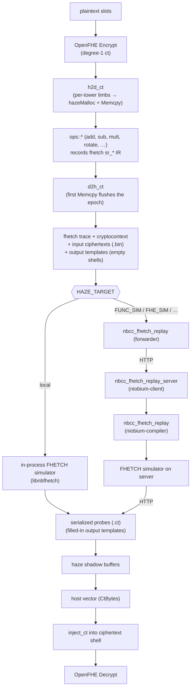

# End-to-end OpenFHE pipeline tests

Each test drives a single CKKS operation through OpenFHE for a
reference, runs the equivalent haze pipeline, and asserts bit-exact RNS
limbs plus slot-tolerance decrypt. Tagged `[integration][e2e]`; runs
under `make test-sim` (in-process FHETCH simulator) and
`make test-transport` (HTTP transport to `nbcc_fhetch_replay`).

## Coverage matrix

| Op | Variants | File |
| --- | --- | --- |
| `add` | 4 scaling modes | `test_openfhe_addition_e2e.cpp` |
| `sub` | 4 | `test_openfhe_sub_e2e.cpp` |
| `scalar-mult` | 5 (FIXEDMANUAL ±rescale, FIXEDAUTO, FLEXIBLEAUTO, FLEXIBLEAUTOEXT) | `test_openfhe_scalar_mult_e2e.cpp` |
| `mul-no-relin` (ct × ct tensor, degree-2) | 5 | `test_openfhe_mul_no_relin_e2e.cpp` |
| `mul` (ct × ct with hybrid-keyswitch relin) | 5 | `test_openfhe_mul_e2e.cpp` |
| `rotate` | 4 modes × slot indices {1, -2} | `test_openfhe_rotate_e2e.cpp` |
| `basic_operations_sequential` (FIDESlib `simple.cpp` parity: cAdd + cSub + cScalar + cMul + cRot1 + cRot2) | 4 | `test_basic_operations_sequential_e2e.cpp` |

The four scaling modes are `FIXEDMANUAL`, `FIXEDAUTO`, `FLEXIBLEAUTO`,
`FLEXIBLEAUTOEXT`.

## Test structure

Each op is a `TEMPLATE_TEST_CASE` parameterised over a **policy struct**
that picks the CKKS scaling technique (and, where the haze pipeline
shape varies per mode, the per-mode flags or apply function). Catch2
monomorphises one named case per policy; per-variant compile errors
stay isolated and the report names are filterable.

Two sources of policies:

- **Shared** (`scaling_modes.hpp`) — four plain policies exposing
  `kTech` and `kName`. Used when the haze pipeline shape is identical
  across all four modes (`add`, `sub`).
- **Op-specific (inline)** — the test file defines its own policies
  that extend the interface with `kPreRescale` / `kPostRescale` flags
  and/or an `apply_openfhe(...)` static. The shared test body branches
  on those flags via `if constexpr`. See `test_openfhe_scalar_mult_e2e.cpp`
  for the canonical pattern.

Ops with a stable cross-mode interface (everything but the per-mode-shape
mul/scalar-mult tests) go through the `ops::*` abstraction in `ops.hpp`
— runtime-dispatched on `OpCtx::mode`. The capstone test chains six ops
through this abstraction in a single epoch.

## Pattern per test

```
plaintext → MakeCKKSPackedPlaintext → Encrypt
        → run OpenFHE reference first (oracle) → Decrypt slots
        → extract per-tower uint64_t limbs of c0,c1 → H2D into haze
        → run haze pipeline (single epoch)
        → D2H each result tower
        → inject back into a Clone of an input ct → Decrypt
        → compare: bit-exact limbs + slot-tolerance ladder
```

Always run the OpenFHE reference **before** any haze compute. OpenFHE
builds with CPROBES instrumentation emit FHETCH IR while a haze epoch
is active, polluting the trace. The same constraint motivates the
`PausedRecording` RAII guard inside `ops::mult_scalar` (the only ops::*
that touches OpenFHE state mid-epoch — for per-tower plaintext
materialisation).

## Data-flow

The same haze trace fans out to two backends. The local sim runs the
FHETCH simulator in-process; the transport path ships the trace over
HTTP to `nbcc_fhetch_replay` (a `niobium-compiler`-built binary) which
runs the simulator on the server side and returns probes.



## Hermeticity rule

E2E tests must work with real CKKS parameters (auto-picked `ring_dim`)
**regardless of test ordering**. If a test only passes in isolation,
that is a state-pollution bug in haze / niobium-fhetch / openfhe — fix
it at the right layer, never paper over by dropping security.

## Adding a new op

1. Drop `test_openfhe_<op>_e2e.cpp` under this directory and add it to
   the `add_executable(haze_tests …)` list in the top-level
   `CMakeLists.txt`.
2. If the pipeline shape is identical across all 4 scaling techniques,
   parameterise over the shared policies in `scaling_modes.hpp` (like
   add/sub).
3. If it varies per mode, define op-specific policies inline (like
   scalar-mult/mul) carrying `kTech` plus the flags/methods the body
   needs.
4. For ops needing extra keys: `cc->EvalMultKeyGen(...)` (mul) and/or
   `cc->EvalRotateKeyGen(...)` (rotate). Use the test-side key-extract
   helpers (`haze::test::extract_evalmult_key_limbs`,
   `haze::test::extract_automorphism_key_limbs` in
   `test/openfhe_key_extract.hpp`) if the haze pipeline needs the KSK limbs.
5. If the op has a stable interface across all four modes, add it to
   `ops.hpp` / `ops.cpp` so the capstone can chain it in.
6. Keep the bit-exact-then-slot-tolerance assertion ladder when the
   haze op is exact at the RNS level. For ops involving keyswitching
   (mul, rotate), the reference is slot-tolerance only.
7. Append a row to the coverage matrix above.

## Running

```sh
# From vendor/niobium-haze:
make build
HAZE_TARGET=local ./dbuild/haze_tests "[e2e]"                          # all e2e
HAZE_TARGET=local ./dbuild/haze_tests "openfhe addition e2e*"          # one op, all variants
HAZE_TARGET=local ./dbuild/haze_tests "openfhe addition e2e - FIXEDMANUAL"  # one variant
make test-sim                                                          # full integration suite
make test-transport NIOBIUM_COMPILER_ROOT=/path/to/niobium-compiler    # HTTP transport
```
